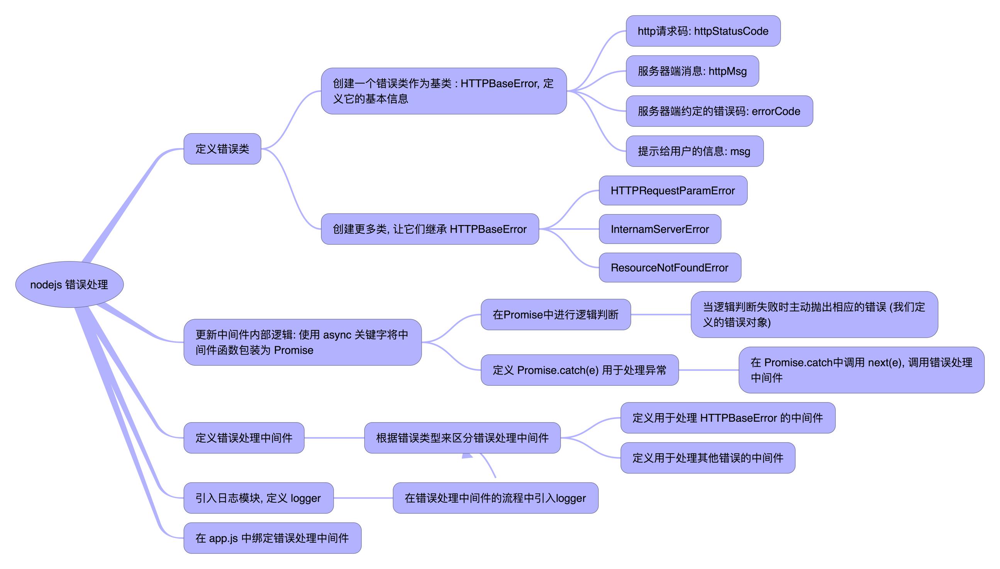

# 说明
* 这是一个 express & mongoose & authentication boilerplate
  * 数据库使用 mongodb + mongoose
  * 登陆验证通过 express-session / JWT 来实现
  * 测试
    * 模拟注册页面: ``` localhost:3000/api/login?username=apolo ```

    * 模拟登陆页面:
        * for JWT (request header is required): ``` localhost:3000/api/hello ```
        * for express-session: ``` localhost:3000/api/hello-session ```

* 项目入口: bin/www

* 错误处理和日志
  * 通过 winston 完成错误日志的记录
  * 流程图:



